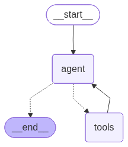

# 🌍 AI Trip Planner  

An **AI-powered travel planning assistant** that helps you design personalized itineraries, explore attractions, check real-time weather, and discover the best places to visit. Whether you’re planning a weekend getaway or a long vacation, this project makes your travel planning **smarter and faster** 🚀.  

  

---

## ✨ Features  
- 🧭 **AI Trip Planning** – Generate day-wise itineraries tailored to your interests.  
- 📍 **Place Recommendations** – Find top attractions, hotels, and restaurants using Google Places & Foursquare APIs.  
- 🌦️ **Weather Integration** – Stay updated with live weather data from OpenWeatherMap.  
- 🤖 **Flexible LLM Support** – Use **OpenAI** or **Groq API keys** to access any supported language model (choose your preferred model).  
- 🎨 **Interactive UI** – Simple and intuitive frontend built with [Streamlit](https://streamlit.io/).  
- ⚡ **Lightweight & Extensible** – Modular design for easy expansion (e.g., flights, hotels, budgeting).  

---

## 🛠️ Tech Stack  
- **Language**: Python 3.9+  
- **Framework**: Streamlit  
- **LLMs**: OpenAI / Groq (select any model with your API key)  
- **APIs**:  
  - OpenWeatherMap (Weather Data)  
  - Google Places API (POI Search)  
  - Foursquare API (Nearby Recommendations)  
- **Environment Management**: `.env` file for API keys  
- **Packaging**: `setup.py` & `pyproject.toml`  

---

## 📂 Project Structure  

```
AI_Trip_Planner/
├── main.py              # Core logic of the app
├── streamlit_app.py     # Streamlit web UI
├── requirements.txt     # Python dependencies
├── pyproject.toml       # Build system configuration
├── setup.py             # Package setup file
├── .env                 # API keys (not shared)
├── .gitignore           # Git ignore rules
├── my_graph.png         # Project diagram/illustration
├── f0dcd0d3-b54b-4b01-a24b-4989ea126bb2.png  # Workflow diagram
├── README.md            # Project documentation
└── .git/                # Git version control
```

---

## 🏗️ Workflow / Architecture  

The following diagram shows how the **AI agent interacts with tools** to plan your trip:  

  

---

## ⚡ Setup & Installation (Step-by-Step Flow)  

Follow this flow to set up the project:  

### 1️⃣ Clone the repository  
```bash
git clone https://github.com/your-username/AI_Trip_Planner.git
cd AI_Trip_Planner
```

### 2️⃣ Create a Virtual Environment  

#### 🔹 Option A: Using Python (venv)  
```bash
# Create venv
python -m venv venv

# Activate venv
# On Windows:
venv\Scripts\activate
# On macOS/Linux:
source venv/bin/activate
```

#### 🔹 Option B: Using Conda  
```bash
# Create new environment
conda create -n tripplanner python=3.9 -y

# Activate environment
conda activate ./tripplanner
```

### 3️⃣ Install dependencies  
```bash
pip install -r requirements.txt
```

### 4️⃣ Setup environment variables  
Create a `.env` file in the root directory and add your API keys:  

```ini
# Weather & Maps APIs
OPENWEATHERMAP_API_KEY=your_api_key_here
GPLACES_API_KEY=your_api_key_here
FOURSQUARE_API_KEY=your_api_key_here

# LLM APIs (choose one)
OPENAI_API_KEY=your_openai_key_here
GROQ_API_KEY=your_groq_key_here
```

💡 You can use either **OpenAI** or **Groq** API keys and select any supported model (e.g., GPT-4, LLaMA, Mixtral).  

### 5️⃣ Run the application  

#### Run with Streamlit (Web UI)  
```bash
streamlit run streamlit_app.py
```

#### Run with Python (CLI Mode)  
```bash
python main.py
```

---

## 📊 Example Workflow  
1. Enter a **destination city**.  
2. AI fetches **places to visit** from Google Places / Foursquare.  
3. Fetches **live weather conditions** for better planning.  
4. Generates a **day-by-day itinerary** based on your duration and preferences.  
5. Answers your questions using your selected **LLM model (OpenAI / Groq)**.  

---
## Output
- <a href="https://drive.google.com/file/d/10nkIjS_ncwOO35z2IaBc8TYef01_yKVS/view?usp=sharing">
View Output File
</a>


## 🤝 Contributing  
Contributions are welcome! 🎉  

Steps to contribute:  
1. Fork the repo  
2. Create a new branch (`feature-xyz`)  
3. Commit your changes  
4. Open a Pull Request  

---

## 📜 License  
This project is licensed under the MIT License.  
